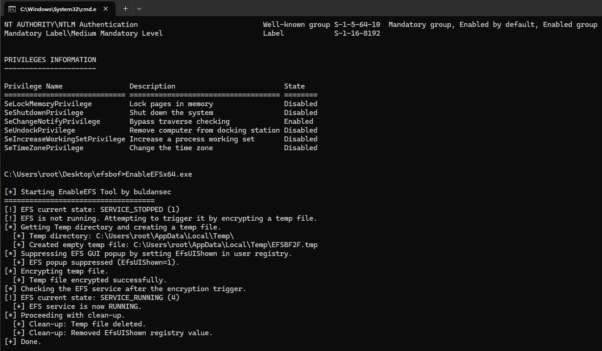
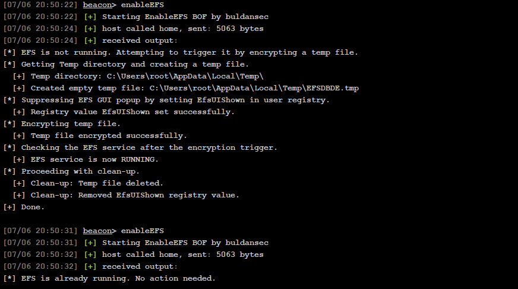

# EnableEFS
Starts the EFS service by creating a temp file and encrypting it using EncryptFileW.
Additionally, sets the EfsUIShown user registry value to prevent EFS UI popups to the user after encryption.
	
> Exists both as as a PE and as CS BOF.
> Supports both x64 and x86
> Does not require admin privileges.

## Usage
### PE:
* `Open cmd and run the executable `
* `Example PE: cmd /k EnableEFSx64.exe`
  
<ul>
  <li></li>
</ul>

### CS:
* `Load EnableEFS.cna to CS with the object files in build`
* `Example CS: enableEFS`
  
<ul>
  <li></li>
</ul>

## Compile Executables
- 1\. Make sure Visual Studio is installed and supports C/C++.
- 2\. Open the `x64/x86 Native Tools Command Prompt for VS <2019/2022>` terminal as administrator.
- 3\. Run `cl EnableEFSx96.c /link Advapi32.lib Shlwapi.lib /out:EnableEFSx64.exe` in x64 terminal to compile x64 executable. 
- 4\. Run `cl EnableEFSx96.c /link Advapi32.lib Shlwapi.lib /out:EnableEFSx86.exe` in x86 terminal to compile x86 executable.
- 4\. In Cobalt strike, use the script manager to load the .cna script to import the tool. 

## Compile BOF
- 1\. The easiest is to run make to compile x64/x86 bof.
- 2\. Alternatively, Open the `cmd` as administrator. Ensure that the Visual Studio path in 'bofcompile.bat' is correct.
- 3\. Run `bofcompile.bat` in terminal to compile x64/x86 BOF. 
- 4\. In Cobalt strike, use the script manager to load the .cna script to import the tool. 

